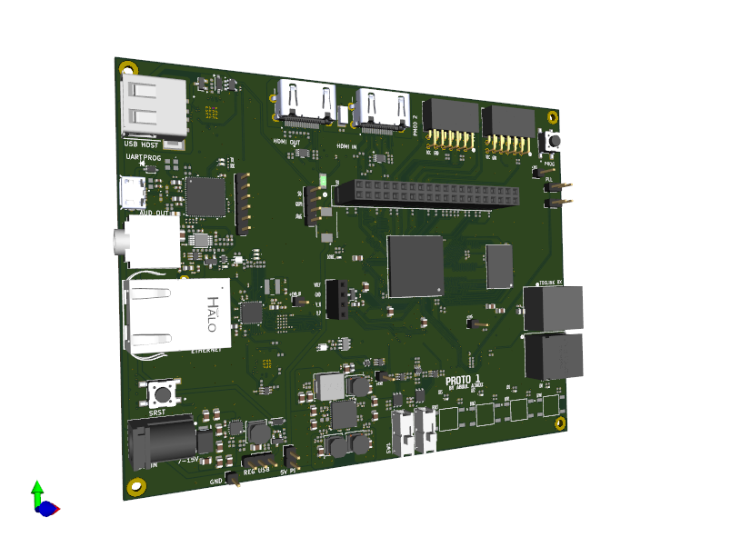

  

**Custom Zynq-7000 FPGA Development Board (Arty Z7–Compatible)**

**Overview**

This project is a custom FPGA development board inspired by the Digilent Arty Z7 platform, designed around the Xilinx Zynq-7000 SoC. The board serves as a general-purpose hardware development and learning platform, with an emphasis on FPGA and ARM (PS/PL) co-design, sound, power and signal-integrity practices, manufacturable industry-style PCB layout, and realistic interfaces commonly used in embedded and FPGA systems. The design is intended for advanced manufacturing and assembly at JLCPCB.

The project targets entry-level to junior FPGA and hardware engineering roles and focuses on demonstrating practical, board-level engineering decisions rather than a minimal breakout-style design.

**Project Status:**

🔧 Design complete – pre-fabrication

🧪 Bring-up and validation will begin after PCB manufacturing

**KEY FEATURES:**
- Xilinx Zynq-7000 SoC (Z7-20 / XC7Z020 class)
- DDR3 SDRAM (PS memory)
- HDMI interface (video output)
- Ethernet PHY (10/100/1000 Mbps)
- USB Host
- USB-JTAG interface
- SPDIF / TOSLINK interface
- QSPI Flash (boot storage)
- microSD card support
- PMOD / GPIO headers
- 40-pin Raspberry Pi interface
- On-board oscillators for PS and PL
- User LEDs, buttons, and switches
- Multi-rail power tree with switching regulators and LDOs

**DESIGN GOALS:**
- Follow Xilinx Zynq hardware design guidelines
- Implement correct decoupling, grounding, and plane usage
- Use controlled-impedance routing for high-speed interfaces
- Be compatible with low-cost PCB manufacturing and assembly
- Serve as a portfolio-quality hardware project

**HARDWARE ARCHITECTURE:**
- Zynq SoC
- ARM Cortex-A9 Processing System (PS)
- Programmable Logic (PL) fabric
- PS-to-PL interconnect exposed for custom designs
- Boot modes supported via QSPI / SD Memory
- DDR3 SDRAM connected to the PS:
- Length-matched address, control, and data groups
- Proper VREF routing and decoupling

**POWER TREE:**

**Input Sources:**

- 7-15V Barrel jack
- Raspberry pi 5V
- USB 5V

**Generated rails:**

- 1.0 V (FPGA core)

- 1.5 V (DDR3)

- 1.8 V (aux, IO)

- 3.3 V (IO and peripherals)

**PCB DESIGN DETAILS:**

- 8-layer PCB stackup

- Dedicated solid ground planeS

- Power planes for core rails

- Signal layers for controlled routing

- Thermal via stitching under FPGA ground regions

**Controlled impedance routing for:**

- DDR3 100Ω diff ±10%, 50Ω single ±10%

- HDMI 100Ω diff ±10%

- Ethernet  100Ω diff ±10%, 50Ω single ±10%

- USB 100Ω diff ±10%, 50Ω single ±10%

- SD  50Ω single ±10%

**INTENDED USE CASES:**

- FPGA and SoC learning platform

- PS/PL co-design experimentation

- HDL development and verification

- Embedded Linux bring-up (future work)

**TOOLS USED:**

- KiCad – schematic capture and PCB layout

- Xilinx Vivado – FPGA design and synthesis

- Vendor datasheets and Xilinx reference designs

- JLCPCB DFM/DFT tools

- JLCPCB Impedance calculator

**Bring-Up Status:**

(Status will be updated as development progresses.)

**Author**

Designed and documented by Abdul Ajadi

Electronics / FPGA Hardware Engineer
